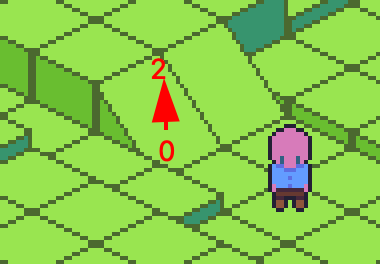
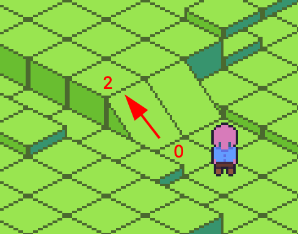

# Cell Navigation Data

Each cell in the `Grid` contains navigation data that is used for pathfinding.

The primary way for setting the nav data is using `Grid::set_nav()`, which takes a `Nav` enum.

### Cost
"Cost" is a common concept in pathfinding and is used throughout the crate. It represents how difficult it is for an agent to move through a given cell. All internal pathfinding systems use cost to find the lowest-cost path to a goal, rather than the absolute shortest one.

You can use cost to discourage agents from entering certain areas. For example, moving through water might be allowed but is assigned a higher cost so that agents avoid that route unless necessary. Another use case would be movement budgets like action points. Each tile could represent a certain number of action points a move costs.

## Nav
`Nav` is the enum used to set cell navigation data. You can set it with `Grid::set_nav()`. For example:

```rust,no_run
// Set 1, 1, 1 to a wall
grid.set_nav(UVec3::new(1, 1, 1), Nav::Impassable)
// Set 2, 2, 2 as "walkable" with a cost of 4.
grid.set_nav(UVec3::new(2, 2, 2), Nav::Passable(4))
// Set 3, 3, 3 as a portal that warps the agent to 7, 7, 7 with a cost of 1,
// one_way is set to true which means a reverse portal at the target will not be created.
grid.set_nav(UVec3::new(3, 3, 3), Nav::Portal(Portal::to(UVec3::new(7, 7, 7), 1, true))) 
```

### `Nav::Impassable`
Marks the cell as impassable (e.g., a wall). Paths will never include this position.
You can default the entire grid to impassable using `GridSettingsBuilder::default_impassable`.

### `Nav::Passable(MovementCost)`

Marks the cell as passable with a specified cost.
By default, `GridSettingsBuilder` sets all cells to passable with a cost of `1`. You can override this with `GridSettingsBuilder::default_cost(u32)`.

This is the main variant used for standard walkable terrain.

### `Nav::Portal(Portal)`

Defines a "portal" that overrides normal neighborhood movement rules. See below for usage.

## Portal: Ramps/Stairs, Elevators, Actual Portals

Portals allow movement between positions that wouldn't normally be adjacent under standard neighborhood rules. They're often used in 2.5D tilemaps to represent elevation changes (e.g., ramps or stairs), but they can also be used for actual teleporters.

### Ramp/Stairs


In the image above, the ramp transitions the agent from Z = 0 to Z = 2, which isn’t normally allowed by OrdinalNeighborhood3d. You can create this behavior by setting a portal at the ramp tile:

```rust,no_run
// Target destination for this portal, which in our case is the current tile x, y + to a height of 2.
let target_pos = UVec3::new(tile_pos.x, tile_pos.y, 2);

// Create the portal for the ramp
grid.set_nav(
    // The position of our ramp cell
    UVec3::new(tile_pos.x, tile_pos.y, 0),
    // You can set the destination to the same x,y position but change the z height
    // We'll set the cost to 2, this is arbitrary.
    Nav::Portal(Portal::to(target_pos, 2, false)),
    // As one_way is set to false, we don't need to worry about creating a reverse portal at the target
    // set_nav will handle that for you.
);
```

Alternatively, place the portals on tiles adjacent to the ramp:



```rust,no_run
// Have the bottom adjacent cell to the ramp portal to the top adjacent cell to the ramp.
grid.set_nav(UVec3::new(0, 0, 0), Nav::Portal(Portal::to(2, 0, 2), 1, false))
```

### Teleporting

To create a teleporter, set the portal destination to any arbitrary map position. You can make it one-way by not adding a reverse portal:

```rust,no_run
/// Let's say the current_tile is at 5, 5, 4
let current_tile = UVec3::new(5, 5, 4);

grid.set_nav(
    current_tile,
    /// This cell can be used as a warp to 45, 45, 0 at a cost of 1.
    Nav::Portal(Portal::to(UVec3::new(45, 45, 0), 1, true))
)
```


### Animations For Portals
You'll likely want to animate transitions when agents use jumps, ramps, or portals.

The `Path::next()` method is useful for this. It returns the next position in the path, which you can compare to the agent's current tile position. This lets you determine what kind of tile the agent is moving into such as a portal, a ramp. Or just test if the Z depth changes and trigger a jump animation.

You can also get the agents current cell navigation data, for example, test if the agent is standing on a portal:

```rust,no_run
if let Some(Nav::Portal(portal)) = grid.nav(position.0) {
    // Trigger some warping particle fx.
}
```